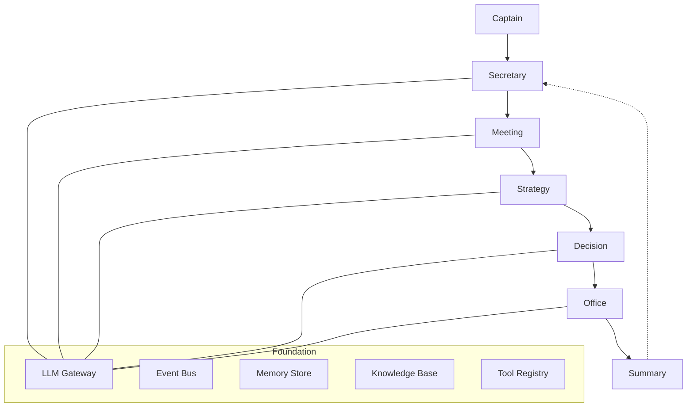

[中文](README_CN.md) | English

# Cabinet

[](https://github.com/VanDING/Cabinet/actions/workflows/ci.yml)
[](https://codecov.io/gh/VanDING/Cabinet)
[](https://www.python.org/downloads/)
[](LICENSE)

An open-source AI collaboration framework for super-individuals and one-person companies.

**Core Philosophy:** Human Harness, AI Execute — you (the Captain) lead, AI employees execute.

## Architecture

### Architecture Diagram



<details>
<summary>Text-based architecture view</summary>

```
┌─────────────────────────────────────────────┐
│            User Interface Layer             │
│          CLI / HTTP API / WebSocket         │
├─────────────────────────────────────────────┤
│         Workspace & Decision Layer          │
│   Meeting → Strategy → Decision → Office    │
│               → Summary + Secretary         │
├─────────────────────────────────────────────┤
│         Agent & Collaboration Layer         │
│     LiteLLMAgent / LLMTeam / Factory        │
├─────────────────────────────────────────────┤
│            Foundation Layer                 │
│  Gateway / EventBus / Memory / Knowledge    │
│  Tools / Workflow / Harness                 │
└─────────────────────────────────────────────┘
```

</details>

### Five-Room Model

| Room | Role | Description |
|------|------|-------------|
| **Meeting** | Thinking | Brainstorm and deliberate on topics |
| **Strategy** | Translation | Decode proposals into actionable blueprints |
| **Decision** | Adjudication | Make decisions with escalation protocols |
| **Office** | Execution | Schedule tasks with verification gates |
| **Summary** | Learning | Extract insights and feed back |
| **Secretary** | Interface | Your single point of contact to the Cabinet |

## Quick Start

### Installation

```bash
pip install -e .
```

### Initialize

```bash
cabinet init "My Organization"
cabinet set-api-key sk-your-api-key --provider openai
```

> **Note:** `cabinet config set-key` is deprecated. Use `cabinet set-api-key` instead. Keys are now stored encrypted in the KeyVault.

### Chat

```bash
cabinet chat
```

### Docker

```bash
docker compose up -d
```

## CLI Reference

### Top-Level Commands

| Command | Description |
|---------|-------------|
| `cabinet init <name>` | Initialize a new Cabinet organization |
| `cabinet serve` | Start the API server |
| `cabinet chat` | Start interactive chat with Secretary |
| `cabinet set-api-key <key> --provider <p>` | Store API key encrypted in KeyVault |
| `cabinet status` | Show organization status |
| `cabinet version` | Show version |

### Config Management

| Command | Description |
|---------|-------------|
| `cabinet config set-key <provider> <key>` | Set API key for a provider *(deprecated, use `set-api-key`)* |
| `cabinet config get-key <provider>` | Get masked API key |
| `cabinet config list-keys` | List all configured providers |
| `cabinet config set-token <token>` | Set API authentication token |
| `cabinet config get-token` | Get current API token |

### Employee Management

| Command | Description |
|---------|-------------|
| `cabinet employee add --name <n> --role <r>` | Add an employee |
| `cabinet employee list` | List all employees |

Options for `employee add`: `--personality`, `--kind` (default: `ai`)

### Skill Management

| Command | Description |
|---------|-------------|
| `cabinet skill load <path>` | Load a skill from a Markdown file |
| `cabinet skill list` | List all loaded skills |
| `cabinet skill run <name>` | Execute a skill |

Options for `skill run`: `-i key=value` (repeatable)

### Knowledge Management

| Command | Description |
|---------|-------------|
| `cabinet knowledge index <path>` | Index documents (.md, .txt) |
| `cabinet knowledge query <question>` | Query the knowledge base |

### Chat Slash Commands

| Command | Description |
|---------|-------------|
| `/meeting <topic>` | Start a deliberation session |
| `/decide <title>` | Submit a decision request |
| `/task <description>` | Submit an execution task |
| `/strategy <proposal>` | Decode a strategic proposal |
| `/review` | Start a review session |
| `/skills` | List available skills |
| `/employees` | List registered employees |
| `/status` | Show pending summary |
| `/help` | Show help |
| `/quit` | Exit chat |

## Interactive API Docs

When the API server is running, interactive documentation is available at:

- **Swagger UI**: `http://localhost:8000/docs`
- **ReDoc**: `http://localhost:8000/redoc`

## API Examples

The API server runs at `http://localhost:8000` by default.

### Authentication

When `api_token` is configured, all endpoints require a Bearer token:

```bash
curl -H "Authorization: Bearer <token>" http://localhost:8000/api/config
```

When `api_token` is empty (default), no authentication is required.

### Chat

**REST:**

```bash
curl -X POST http://localhost:8000/api/chat \
  -H "Content-Type: application/json" \
  -d '{"message": "Hello", "captain_id": "captain"}'
```

**WebSocket:**

```javascript
const ws = new WebSocket("ws://localhost:8000/api/chat/ws?captain_id=captain&token=<token>");
ws.onmessage = (e) => console.log(JSON.parse(e.data));
ws.send("Hello");
```

Response format: `{"type": "chunk", "content": "..."}` followed by `{"type": "done"}`

### Employees

```bash
# List employees
curl http://localhost:8000/api/employees

# Create employee
curl -X POST http://localhost:8000/api/employees \
  -H "Content-Type: application/json" \
  -d '{"name": "Analyst", "role": "analyst", "kind": "ai"}'

# Get employee
curl http://localhost:8000/api/employees/<employee_id>

# Mount skill to employee
curl -X POST http://localhost:8000/api/employees/<employee_id>/skills/<skill_id>
```

### Skills

```bash
# List skills
curl http://localhost:8000/api/skills

# Load skill
curl -X POST "http://localhost:8000/api/skills/load?path=/path/to/skill.md"

# Run skill
curl -X POST http://localhost:8000/api/skills/<name>/run \
  -H "Content-Type: application/json" \
  -d '{"inputs": {"key": "value"}}'
```

### Knowledge

```bash
# Index documents
curl -X POST http://localhost:8000/api/knowledge/index \
  -H "Content-Type: application/json" \
  -d '{"path": "/path/to/docs"}'

# Query knowledge base
curl -X POST http://localhost:8000/api/knowledge/query \
  -H "Content-Type: application/json" \
  -d '{"question": "What is Cabinet?", "top_k": 3}'
```

### Rooms

```bash
# Meeting
curl -X POST http://localhost:8000/api/rooms/meeting \
  -H "Content-Type: application/json" \
  -d '{"topic": "Q3 Strategy", "level": "multi_party"}'

# Decision
curl -X POST http://localhost:8000/api/rooms/decision \
  -H "Content-Type: application/json" \
  -d '{"title": "Hire new analyst", "decision_type": "action"}'

# Task
curl -X POST http://localhost:8000/api/rooms/task \
  -H "Content-Type: application/json" \
  -d '{"description": "Prepare quarterly report"}'

# Strategy
curl -X POST http://localhost:8000/api/rooms/strategy \
  -H "Content-Type: application/json" \
  -d '{"proposal": "Expand to European market"}'

# Review
curl -X POST http://localhost:8000/api/rooms/review \
  -H "Content-Type: application/json" \
  -d '{"review_type": "project_review"}'
```

### Config

```bash
# Get current config
curl http://localhost:8000/api/config

# List available models
curl http://localhost:8000/api/config/models
```

## Configuration

### Environment Variables

| Variable | Default | Description |
|----------|---------|-------------|
| `CABINET_DATA_DIR` | `data` | Data directory path |
| `CABINET_LOG_LEVEL` | `INFO` | Logging level (DEBUG/INFO/WARNING/ERROR) |
| `LITELLM_API_KEYS_OPENAI` | (empty) | OpenAI API key |
| `LITELLM_API_KEYS_ANTHROPIC` | (empty) | Anthropic API key |

### Model Configuration

Models are configured in `data/models.json` using the LiteLLM Router format:

```json
[
  {
    "model_name": "default",
    "litellm_params": {
      "model": "gpt-4o-mini"
    }
  },
  {
    "model_name": "fast",
    "litellm_params": {
      "model": "gpt-4o-mini"
    }
  }
]
```

### MCP Servers

Add MCP servers in `data/cabinet.json`:

```json
{
  "mcp_servers": [
    {
      "name": "filesystem",
      "transport": "stdio",
      "command": "npx",
      "args": ["-y", "@modelcontextprotocol/server-filesystem", "/path"]
    }
  ]
}
```

### API Authentication

Set an API token to protect all endpoints:

```bash
cabinet config set-token your-secret-token
```

When configured, all API requests require `Authorization: Bearer your-secret-token`.

### Memory Storage

Set `memory_type` in `data/cabinet.json`:

- `"chromadb"` (default) — Vector-based long-term memory with semantic search
- `"sqlite"` — Simple SQLite-based short-term memory

## Python SDK

```python
from cabinet import CabinetRuntime, CabinetConfig
from cabinet.core.memory import SQLiteMemoryStore
from cabinet.agents import StubAgentFactory

async def main():
    runtime = CabinetRuntime(
        agent_factory=StubAgentFactory(),
        db_path="data/db/cabinet.db",
        memory_store=SQLiteMemoryStore(db_path="data/db/memory.db"),
    )
    await runtime.start()

    greeting = await runtime.secretary.greet(captain_id="captain")
    print(greeting.message)

    await runtime.stop()
```

## Observability

Cabinet includes built-in observability with OpenTelemetry tracing and Prometheus metrics.

### Configuration

```python
from cabinet.core.observability import ObservabilityConfig

config = ObservabilityConfig(
    enabled=True,
    service_name="my-cabinet",
    log_level="INFO",
    log_format="json",
    otlp_endpoint="http://localhost:4317",
    prometheus_port=9090,
)
```

### Metrics Endpoint

Prometheus metrics are exposed at `http://localhost:9090/metrics` when observability is enabled.

### Environment Variables

| Variable | Default | Description |
|----------|---------|-------------|
| `CABINET_OBSERVABILITY_ENABLED` | `true` | Enable/disable observability |
| `CABINET_OTLP_ENDPOINT` | (empty) | OpenTelemetry OTLP gRPC endpoint |
| `CABINET_PROMETHEUS_PORT` | `9090` | Prometheus metrics port |

## Deployment

### Docker

```bash
# Build and run
docker compose up -d

# With API keys
OPENAI_API_KEY=sk-xxx docker compose up -d

# View logs
docker compose logs -f

# Stop
docker compose down
```

Data persists in the `cabinet-data` Docker volume.

### Manual

```bash
cabinet serve --host 0.0.0.0 --port 8000 --data-dir /data
```

## Development

```bash
# Install with dev dependencies
pip install -e ".[dev]"

# Run tests
pytest tests/ -v

# Lint
ruff check src/ tests/

# Build
pip wheel . --no-deps -w dist/
```

CI runs automatically on push/PR to `main` via GitHub Actions.
