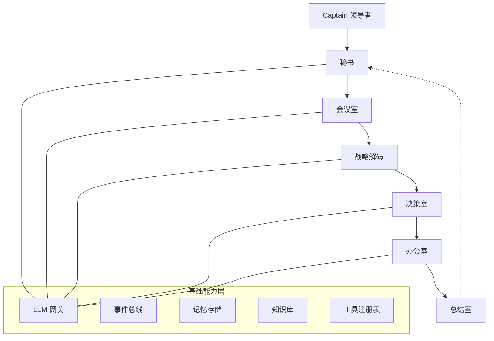

中文 | [English](README.md)

# Cabinet

[](https://github.com/user/cabinet/actions/workflows/ci.yml)
[](https://www.python.org/downloads/)
[](LICENSE)

面向超级个体和一人公司的开源 AI 协作框架。

**核心理念：** 人类驾驭，AI 执行 — 你（Captain）主导，AI 员工执行。

## 架构

### 架构图



<details>
<summary>文本架构视图</summary>

```
┌─────────────────────────────────────────────┐
│              用户界面层                       │
│          CLI / HTTP API / WebSocket          │
├─────────────────────────────────────────────┤
│            工作空间与决策层                    │
│     会议室 → 战略解码 → 决策室 → 办公室       │
│              → 总结室 + 秘书                  │
├─────────────────────────────────────────────┤
│            智能体与协作层                      │
│      LiteLLMAgent / LLMTeam / Factory        │
├─────────────────────────────────────────────┤
│              基础能力层                        │
│   网关 / 事件总线 / 记忆 / 知识库              │
│   工具 / 工作流 / 驾驭层                      │
└─────────────────────────────────────────────┘
```

</details>

### 五室模型

| 房间 | 角色 | 描述 |
|------|------|------|
| **会议室** | 思考层 | 头脑风暴与审议 |
| **战略解码** | 转化层 | 将提案解码为可执行蓝图 |
| **决策室** | 裁决层 | 带升级协议的决策制定 |
| **办公室** | 执行层 | 带验证闸门的任务调度 |
| **总结室** | 学习层 | 提取洞察与反馈 |
| **秘书** | 交互层 | 你与 Cabinet 的唯一交互界面 |

## 快速开始

### 安装

```bash
pip install -e .
```

### 初始化

```bash
cabinet init "我的组织"
cabinet set-api-key sk-your-api-key --provider openai
```

> **注意：** `cabinet config set-key` 已弃用，请使用 `cabinet set-api-key`。密钥现在以加密方式存储在 KeyVault 中。

### 聊天

```bash
cabinet chat
```

### Docker

```bash
docker compose up -d
```

## CLI 参考

### 顶层命令

| 命令 | 描述 |
|------|------|
| `cabinet init <name>` | 初始化新的 Cabinet 组织 |
| `cabinet serve` | 启动 API 服务器 |
| `cabinet chat` | 启动与秘书的交互式聊天 |
| `cabinet set-api-key <key> --provider <p>` | 加密存储 API 密钥到 KeyVault |
| `cabinet status` | 显示组织状态 |
| `cabinet version` | 显示版本号 |

### 配置管理

| 命令 | 描述 |
|------|------|
| `cabinet config set-key <provider> <key>` | 设置 API 密钥 *（已弃用，请使用 `set-api-key`）* |
| `cabinet config get-key <provider>` | 查看已配置的密钥（脱敏） |
| `cabinet config list-keys` | 列出所有已配置的提供商 |
| `cabinet config set-token <token>` | 设置 API 认证令牌 |
| `cabinet config get-token` | 查看当前 API 令牌 |

### 员工管理

| 命令 | 描述 |
|------|------|
| `cabinet employee add --name <n> --role <r>` | 添加员工 |
| `cabinet employee list` | 列出所有员工 |

`employee add` 选项：`--personality`，`--kind`（默认：`ai`）

### 技能管理

| 命令 | 描述 |
|------|------|
| `cabinet skill load <path>` | 从 Markdown 文件加载技能 |
| `cabinet skill list` | 列出所有已加载技能 |
| `cabinet skill run <name>` | 执行技能 |

`skill run` 选项：`-i key=value`（可重复）

### 知识库管理

| 命令 | 描述 |
|------|------|
| `cabinet knowledge index <path>` | 索引文档（.md、.txt） |
| `cabinet knowledge query <question>` | 查询知识库 |

### 聊天斜杠命令

| 命令 | 描述 |
|------|------|
| `/meeting <topic>` | 启动审议会议 |
| `/decide <title>` | 提交决策请求 |
| `/task <description>` | 提交执行任务 |
| `/strategy <proposal>` | 解码战略提案 |
| `/review` | 启动审查会话 |
| `/skills` | 列出可用技能 |
| `/employees` | 列出已注册员工 |
| `/status` | 显示待处理摘要 |
| `/help` | 显示帮助 |
| `/quit` | 退出聊天 |

## 交互式 API 文档

API 服务器运行时，可通过以下地址访问交互式文档：

- **Swagger UI**：`http://localhost:8000/docs`
- **ReDoc**：`http://localhost:8000/redoc`

## API 示例

API 服务器默认运行在 `http://localhost:8000`。

### 认证

配置 `api_token` 后，所有端点需要 Bearer 令牌：

```bash
curl -H "Authorization: Bearer <token>" http://localhost:8000/api/config
```

`api_token` 为空（默认）时无需认证。

### 聊天

**REST：**

```bash
curl -X POST http://localhost:8000/api/chat \
  -H "Content-Type: application/json" \
  -d '{"message": "你好", "captain_id": "captain"}'
```

**WebSocket：**

```javascript
const ws = new WebSocket("ws://localhost:8000/api/chat/ws?captain_id=captain&token=<token>");
ws.onmessage = (e) => console.log(JSON.parse(e.data));
ws.send("你好");
```

响应格式：`{"type": "chunk", "content": "..."}` 后跟 `{"type": "done"}`

### 员工

```bash
# 列出员工
curl http://localhost:8000/api/employees

# 创建员工
curl -X POST http://localhost:8000/api/employees \
  -H "Content-Type: application/json" \
  -d '{"name": "分析师", "role": "analyst", "kind": "ai"}'

# 获取员工
curl http://localhost:8000/api/employees/<employee_id>

# 为员工挂载技能
curl -X POST http://localhost:8000/api/employees/<employee_id>/skills/<skill_id>
```

### 技能

```bash
# 列出技能
curl http://localhost:8000/api/skills

# 加载技能
curl -X POST "http://localhost:8000/api/skills/load?path=/path/to/skill.md"

# 执行技能
curl -X POST http://localhost:8000/api/skills/<name>/run \
  -H "Content-Type: application/json" \
  -d '{"inputs": {"key": "value"}}'
```

### 知识库

```bash
# 索引文档
curl -X POST http://localhost:8000/api/knowledge/index \
  -H "Content-Type: application/json" \
  -d '{"path": "/path/to/docs"}'

# 查询知识库
curl -X POST http://localhost:8000/api/knowledge/query \
  -H "Content-Type: application/json" \
  -d '{"question": "Cabinet 是什么？", "top_k": 3}'
```

### 房间操作

```bash
# 会议室
curl -X POST http://localhost:8000/api/rooms/meeting \
  -H "Content-Type: application/json" \
  -d '{"topic": "Q3 战略", "level": "multi_party"}'

# 决策室
curl -X POST http://localhost:8000/api/rooms/decision \
  -H "Content-Type: application/json" \
  -d '{"title": "招聘新分析师", "decision_type": "action"}'

# 办公室
curl -X POST http://localhost:8000/api/rooms/task \
  -H "Content-Type: application/json" \
  -d '{"description": "准备季度报告"}'

# 战略解码
curl -X POST http://localhost:8000/api/rooms/strategy \
  -H "Content-Type: application/json" \
  -d '{"proposal": "拓展欧洲市场"}'

# 总结室
curl -X POST http://localhost:8000/api/rooms/review \
  -H "Content-Type: application/json" \
  -d '{"review_type": "project_review"}'
```

### 配置查询

```bash
# 获取当前配置
curl http://localhost:8000/api/config

# 列出可用模型
curl http://localhost:8000/api/config/models
```

## 配置指南

### 环境变量

| 变量 | 默认值 | 描述 |
|------|--------|------|
| `CABINET_DATA_DIR` | `data` | 数据目录路径 |
| `CABINET_LOG_LEVEL` | `INFO` | 日志级别（DEBUG/INFO/WARNING/ERROR） |
| `LITELLM_API_KEYS_OPENAI` | （空） | OpenAI API 密钥 |
| `LITELLM_API_KEYS_ANTHROPIC` | （空） | Anthropic API 密钥 |

### 模型配置

模型在 `data/models.json` 中配置，使用 LiteLLM Router 格式：

```json
[
  {
    "model_name": "default",
    "litellm_params": {
      "model": "gpt-4o-mini"
    }
  },
  {
    "model_name": "fast",
    "litellm_params": {
      "model": "gpt-4o-mini"
    }
  }
]
```

### MCP 服务器

在 `data/cabinet.json` 中添加 MCP 服务器：

```json
{
  "mcp_servers": [
    {
      "name": "filesystem",
      "transport": "stdio",
      "command": "npx",
      "args": ["-y", "@modelcontextprotocol/server-filesystem", "/path"]
    }
  ]
}
```

### API 认证

设置 API 令牌以保护所有端点：

```bash
cabinet config set-token your-secret-token
```

配置后，所有 API 请求需要 `Authorization: Bearer your-secret-token`。

### 记忆存储

在 `data/cabinet.json` 中设置 `memory_type`：

- `"chromadb"`（默认）— 基于向量的长期记忆，支持语义搜索
- `"sqlite"` — 基于 SQLite 的短期记忆

## Python SDK

```python
from cabinet import CabinetRuntime, CabinetConfig
from cabinet.core.memory import SQLiteMemoryStore
from cabinet.agents import StubAgentFactory

async def main():
    runtime = CabinetRuntime(
        agent_factory=StubAgentFactory(),
        db_path="data/db/cabinet.db",
        memory_store=SQLiteMemoryStore(db_path="data/db/memory.db"),
    )
    await runtime.start()

    greeting = await runtime.secretary.greet(captain_id="captain")
    print(greeting.message)

    await runtime.stop()
```

## 可观测性

Cabinet 内置 OpenTelemetry 链路追踪和 Prometheus 指标。

### 配置

```python
from cabinet.core.observability import ObservabilityConfig

config = ObservabilityConfig(
    enabled=True,
    service_name="my-cabinet",
    log_level="INFO",
    log_format="json",
    otlp_endpoint="http://localhost:4317",
    prometheus_port=9090,
)
```

### 指标端点

启用可观测性后，Prometheus 指标在 `http://localhost:9090/metrics` 暴露。

### 环境变量

| 变量 | 默认值 | 描述 |
|------|--------|------|
| `CABINET_OBSERVABILITY_ENABLED` | `true` | 启用/禁用可观测性 |
| `CABINET_OTLP_ENDPOINT` | （空） | OpenTelemetry OTLP gRPC 端点 |
| `CABINET_PROMETHEUS_PORT` | `9090` | Prometheus 指标端口 |

## 部署

### Docker

```bash
# 构建并运行
docker compose up -d

# 带 API 密钥
OPENAI_API_KEY=sk-xxx docker compose up -d

# 查看日志
docker compose logs -f

# 停止
docker compose down
```

数据持久化在 `cabinet-data` Docker 卷中。

### 手动部署

```bash
cabinet serve --host 0.0.0.0 --port 8000 --data-dir /data
```

## 开发

```bash
# 安装开发依赖
pip install -e ".[dev]"

# 运行测试
pytest tests/ -v

# 代码检查
ruff check src/ tests/

# 构建
pip wheel . --no-deps -w dist/
```

CI 在 push/PR 到 `main` 分支时通过 GitHub Actions 自动运行。
