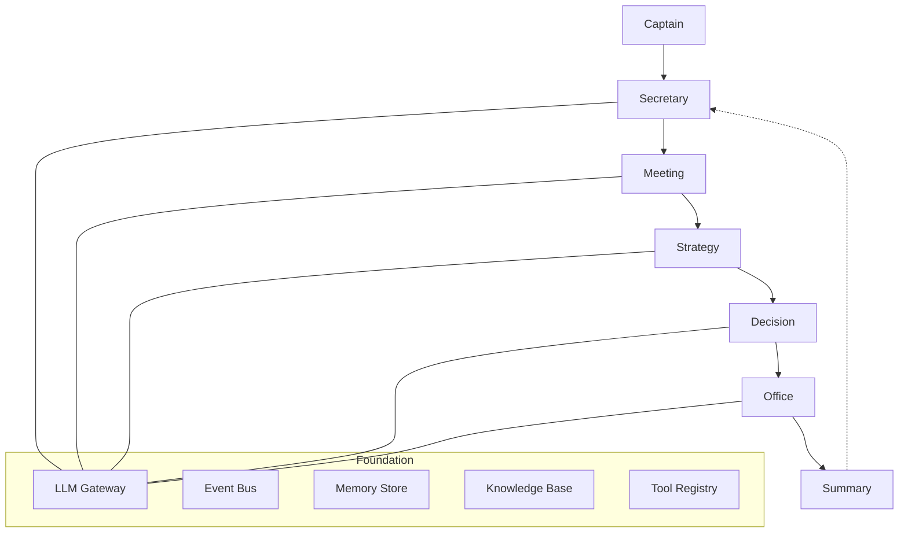
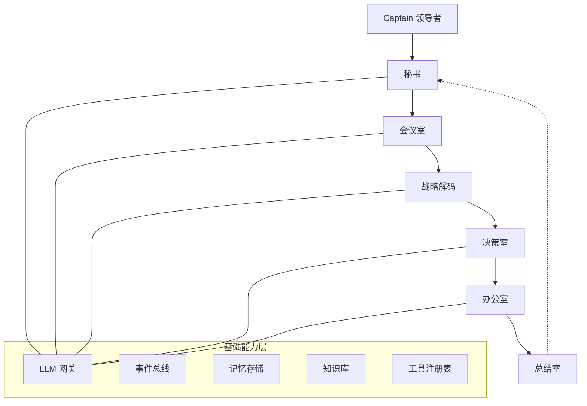

# 收尾 + 发布准备 实施计划

> **For agentic workers:** REQUIRED SUB-SKILL: Use superpowers:subagent-driven-development (recommended) or superpowers:executing-plans to implement this plan task-by-task. Steps use checkbox (`- [ ]`) syntax for tracking.

**Goal:** 修复所有遗留缺口，完成 PyPI 发布准备，验证端到端流程，审查文档，使项目达到可发布状态。

**Architecture:** 严格分层递进 — L1 遗留修复 → L2 PyPI 发布准备 → L3 端到端验证 → L4 文档审查。每层完成后形成稳定基线，后续层不返工。

**Tech Stack:** Python 3.12+, Pydantic v2, FastAPI, Typer, httpx, hatchling

---

## File Structure

| Action | File | Responsibility |
|--------|------|---------------|
| Modify | `src/cabinet/__init__.py` | 统一版本号来源（动态获取） |
| Modify | `src/cabinet/runtime.py` | 删除本地 `__version__`，改为从 `cabinet` 导入 |
| Modify | `src/cabinet/api/app.py` | 删除硬编码版本号，改为从 `cabinet` 导入 |
| Modify | `src/cabinet/api/routes/health.py` | 删除硬编码版本号，改为从 `cabinet` 导入 |
| Modify | `src/cabinet/cli/main.py` | 修复 `init` 命令提示 |
| Modify | `examples/e2e_workflow.py` | 修复 `_shared.py` 导入路径 |
| Modify | `examples/tutorial.py` | 修复 `_shared.py` 导入路径 |
| Create | `examples/api_examples.py` | 跨平台 Python API 示例 |
| Modify | `README.md` | Mermaid 架构图 + 弃用标记 + API 文档说明 |
| Modify | `README_CN.md` | Mermaid 架构图 + 弃用标记 + API 文档说明 |
| Modify | `pyproject.toml` | 完善 PyPI 元数据 |
| Create | `LICENSE` | MIT 许可证 |
| Create | `CHANGELOG.md` | 变更日志 |
| Create | `scripts/release.sh` | 发布脚本 |
| Create | `CONTRIBUTING.md` | 贡献指南 |
| Test | `tests/unit/cli/test_main.py` | 验证 init 命令提示 |

---

## L1 遗留缺口修复

### Task 1: 统一 `__version__` 定义

**Files:**
- Modify: `src/cabinet/__init__.py`
- Modify: `src/cabinet/runtime.py:48-51`
- Modify: `src/cabinet/api/app.py:37`
- Modify: `src/cabinet/api/routes/health.py:18`
- Test: `tests/unit/cli/test_main.py`（已有 `test_version`）

- [ ] **Step 1: 修改 `src/cabinet/__init__.py` — 动态获取版本号**

将 `__init__.py` 改为：

```python
try:
    from importlib.metadata import version as _pkg_version

    __version__ = _pkg_version("cabinet")
except Exception:
    __version__ = "0.1.0"


def __getattr__(name: str):
    if name == "CabinetRuntime":
        from cabinet.runtime import CabinetRuntime

        return CabinetRuntime
    if name == "CabinetConfig":
        from cabinet.cli.config import CabinetConfig

        return CabinetConfig
    raise AttributeError(f"module 'cabinet' has no attribute {name!r}")


__all__ = ["CabinetRuntime", "CabinetConfig", "__version__"]
```

- [ ] **Step 2: 修改 `src/cabinet/runtime.py` — 删除本地 `__version__`，改为导入**

删除 `runtime.py` 第 48-51 行：

```python
try:
    __version__ = _pkg_version("cabinet")
except Exception:
    __version__ = "0.1.0"
```

在第 12 行附近（`from cabinet import __version__` 已存在于第 12 行，确认无需修改）。

检查：`runtime.py` 第 12 行已有 `from cabinet import __version__`，所以只需删除第 48-51 行的本地定义。同时删除第 5 行的 `from importlib.metadata import version as _pkg_version`（如果不再被其他代码使用）。

将 `runtime.py` 顶部修改为：

```python
from __future__ import annotations

import logging
import time as _time
from typing import TYPE_CHECKING

from cabinet import __version__
from cabinet.agents.protocol import AgentFactory
```

删除第 5 行 `from importlib.metadata import version as _pkg_version` 和第 48-51 行的本地 `__version__` 定义。

- [ ] **Step 3: 修改 `src/cabinet/api/app.py` — 删除硬编码版本号**

将 `app.py` 第 37 行：

```python
        version="0.1.0",
```

改为：

```python
        version=__version__,
```

在 `app.py` 顶部添加导入（在 `from fastapi import ...` 之前）：

```python
from cabinet import __version__
```

- [ ] **Step 4: 修改 `src/cabinet/api/routes/health.py` — 删除硬编码版本号**

将 `health.py` 第 18 行：

```python
        version="0.1.0",
```

改为：

```python
        version=__version__,
```

在 `health.py` 顶部添加导入：

```python
from cabinet import __version__
```

- [ ] **Step 5: 运行测试验证**

Run: `python -m pytest tests/unit/cli/test_main.py::test_version tests/unit/api/ -v`
Expected: 全部 PASS

- [ ] **Step 6: Commit**

```bash
git add src/cabinet/__init__.py src/cabinet/runtime.py src/cabinet/api/app.py src/cabinet/api/routes/health.py
git commit -m "fix: unify __version__ to single source in cabinet/__init__.py"
```

---

### Task 2: 修复 `init` 命令提示

**Files:**
- Modify: `src/cabinet/cli/main.py:71`
- Test: `tests/unit/cli/test_main.py`

- [ ] **Step 1: 写失败测试 — 验证 init 命令提示使用 `set-api-key`**

在 `tests/unit/cli/test_main.py` 末尾添加：

```python
def test_init_shows_set_api_key_hint():
    with tempfile.TemporaryDirectory() as tmpdir:
        result = runner.invoke(app, ["init", "TestOrg", "--data-dir", tmpdir])
        assert result.exit_code == 0
        assert "set-api-key" in result.output
        assert "config set-key" not in result.output or "deprecated" in result.output.lower()
```

- [ ] **Step 2: 运行测试验证失败**

Run: `python -m pytest tests/unit/cli/test_main.py::test_init_shows_set_api_key_hint -v`
Expected: FAIL（因为当前输出包含 `config set-key` 且不含 `set-api-key`）

- [ ] **Step 3: 修改 `src/cabinet/cli/main.py:71`**

将第 71 行：

```python
            f"1. Configure API keys:  cabinet config set-key openai sk-xxx\n"
```

改为：

```python
            f"1. Configure API keys:  cabinet set-api-key sk-xxx --provider openai\n"
```

- [ ] **Step 4: 运行测试验证通过**

Run: `python -m pytest tests/unit/cli/test_main.py::test_init_shows_set_api_key_hint -v`
Expected: PASS

- [ ] **Step 5: Commit**

```bash
git add src/cabinet/cli/main.py tests/unit/cli/test_main.py
git commit -m "fix: update init hint to use set-api-key instead of deprecated config set-key"
```

---

### Task 3: 修复 `_shared.py` 导入路径

**Files:**
- Modify: `examples/e2e_workflow.py:1-15`
- Modify: `examples/tutorial.py:1-16`

- [ ] **Step 1: 修改 `examples/e2e_workflow.py` — 添加 sys.path 修正**

将文件开头（第 1-15 行）改为：

```python
"""Cabinet end-to-end workflow demo.

Usage:
    python examples/e2e_workflow.py --data-dir data
    python examples/e2e_workflow.py --data-dir data --live
"""
import argparse
import asyncio
import os
import sys
from uuid import uuid4

sys.path.insert(0, os.path.dirname(os.path.abspath(__file__)))

from rich.console import Console
from rich.panel import Panel
from rich.table import Table

from _shared import setup_runtime
```

- [ ] **Step 2: 修改 `examples/tutorial.py` — 添加 sys.path 修正**

将文件开头（第 1-16 行）改为：

```python
"""Cabinet Interactive Tutorial.

Usage:
    python examples/tutorial.py --data-dir data
    python examples/tutorial.py --data-dir data --live
"""
import argparse
import asyncio
import os
import sys
from uuid import uuid4

sys.path.insert(0, os.path.dirname(os.path.abspath(__file__)))

from rich.console import Console
from rich.panel import Panel
from rich.progress import Progress
from rich.prompt import Prompt

from _shared import setup_runtime
```

- [ ] **Step 3: 验证导入正常**

Run: `python -c "import sys; sys.path.insert(0, 'examples'); from _shared import setup_runtime; print('OK')"`
Expected: `OK`

- [ ] **Step 4: Commit**

```bash
git add examples/e2e_workflow.py examples/tutorial.py
git commit -m "fix: add sys.path fix for _shared.py import in examples"
```

---

### Task 4: 创建 `api_examples.py` 跨平台 Python API 示例

**Files:**
- Create: `examples/api_examples.py`

- [ ] **Step 1: 创建 `examples/api_examples.py`**

```python
"""Cabinet API Usage Examples (cross-platform Python).

Usage:
    python examples/api_examples.py
    python examples/api_examples.py --base-url http://localhost:8000 --token mytoken
"""
import argparse
import json
import os
import sys

sys.path.insert(0, os.path.dirname(os.path.abspath(__file__)))

import httpx

BASE_URL = "http://localhost:8000"
TOKEN = ""


def _headers() -> dict[str, str]:
    headers = {"Content-Type": "application/json"}
    if TOKEN:
        headers["Authorization"] = f"Bearer {TOKEN}"
    return headers


def _print(label: str, response: httpx.Response) -> None:
    print(f"\n=== {label} ===")
    print(f"Status: {response.status_code}")
    try:
        print(json.dumps(response.json(), indent=2, ensure_ascii=False))
    except Exception:
        print(response.text[:500])


def main():
    global BASE_URL, TOKEN

    parser = argparse.ArgumentParser(description="Cabinet API Usage Examples")
    parser.add_argument("--base-url", default="http://localhost:8000")
    parser.add_argument("--token", default="")
    args = parser.parse_args()
    BASE_URL = args.base_url
    TOKEN = args.token or os.environ.get("CABINET_TOKEN", "")

    print("=" * 45)
    print("  Cabinet API Usage Examples (Python)")
    print("=" * 45)

    with httpx.Client(timeout=30.0) as client:
        print("\n--- Health Check ---")
        _print("GET /health", client.get(f"{BASE_URL}/health"))
        _print("GET /ready", client.get(f"{BASE_URL}/ready"))

        print("\n--- Chat (REST) ---")
        _print("POST /api/chat", client.post(
            f"{BASE_URL}/api/chat",
            headers=_headers(),
            json={"message": "Hello Cabinet!", "captain_id": "captain"},
        ))

        print("\n--- Employees ---")
        _print("GET /api/employees/", client.get(f"{BASE_URL}/api/employees/", headers=_headers()))
        _print("POST /api/employees/ (create)", client.post(
            f"{BASE_URL}/api/employees/",
            headers=_headers(),
            json={"name": "Analyst", "role": "analyst", "kind": "ai"},
        ))

        print("\n--- Skills ---")
        _print("GET /api/skills/", client.get(f"{BASE_URL}/api/skills/", headers=_headers()))

        print("\n--- Knowledge ---")
        _print("POST /api/knowledge/index", client.post(
            f"{BASE_URL}/api/knowledge/index",
            headers=_headers(),
            json={"path": "data/knowledge"},
        ))
        _print("POST /api/knowledge/query", client.post(
            f"{BASE_URL}/api/knowledge/query",
            headers=_headers(),
            json={"question": "What is Cabinet?", "top_k": 3},
        ))

        print("\n--- Rooms ---")
        _print("POST /api/rooms/meeting", client.post(
            f"{BASE_URL}/api/rooms/meeting",
            headers=_headers(),
            json={"topic": "Product strategy", "level": "multi_party"},
        ))
        _print("POST /api/rooms/decision", client.post(
            f"{BASE_URL}/api/rooms/decision",
            headers=_headers(),
            json={"title": "Launch timing", "decision_type": "strategic"},
        ))
        _print("POST /api/rooms/office/task", client.post(
            f"{BASE_URL}/api/rooms/office/task",
            headers=_headers(),
            json={"description": "Write market analysis report"},
        ))
        _print("POST /api/rooms/strategy", client.post(
            f"{BASE_URL}/api/rooms/strategy",
            headers=_headers(),
            json={"proposal": "Expand to healthcare vertical"},
        ))
        _print("POST /api/rooms/summary/review", client.post(
            f"{BASE_URL}/api/rooms/summary/review",
            headers=_headers(),
            json={"review_type": "project_review"},
        ))

        print("\n--- Config ---")
        _print("GET /api/config/", client.get(f"{BASE_URL}/api/config/", headers=_headers()))

        print("\n--- Prometheus Metrics ---")
        try:
            metrics_resp = httpx.get("http://localhost:9090/metrics", timeout=5.0)
            lines = [l for l in metrics_resp.text.splitlines() if l.startswith("cabinet_")]
            print(f"\n=== Prometheus Metrics (showing first 20 cabinet_ lines) ===")
            for line in lines[:20]:
                print(line)
        except Exception:
            print("(Prometheus not available)")

    print("\n" + "=" * 45)
    print("  Examples complete!")
    print("=" * 45)


if __name__ == "__main__":
    main()
```

- [ ] **Step 2: 验证语法正确**

Run: `python -c "import py_compile; py_compile.compile('examples/api_examples.py', doraise=True); print('OK')"`
Expected: `OK`

- [ ] **Step 3: Commit**

```bash
git add examples/api_examples.py
git commit -m "feat: add cross-platform Python API examples (api_examples.py)"
```

---

### Task 5: README 添加 Mermaid 架构图 + 弃用标记 + API 文档说明

**Files:**
- Modify: `README.md`
- Modify: `README_CN.md`

- [ ] **Step 1: 修改 `README.md` — 替换 ASCII 架构图为 Mermaid**

将 `README.md` 第 15-31 行的 ASCII 架构图替换为：

```markdown
### Architecture Diagram



<details>
<summary>Text-based architecture view</summary>

```
┌─────────────────────────────────────────────┐
│            User Interface Layer             │
│          CLI / HTTP API / WebSocket         │
├─────────────────────────────────────────────┤
│         Workspace & Decision Layer          │
│   Meeting → Strategy → Decision → Office    │
│               → Summary + Secretary         │
├─────────────────────────────────────────────┤
│         Agent & Collaboration Layer         │
│     LiteLLMAgent / LLMTeam / Factory        │
├─────────────────────────────────────────────┤
│            Foundation Layer                 │
│  Gateway / EventBus / Memory / Knowledge    │
│  Tools / Workflow / Harness                 │
└─────────────────────────────────────────────┘
```

</details>
```

- [ ] **Step 2: 修改 `README.md` — Config Management 表格中 `config set-key` 标注弃用**

将第 90 行：

```markdown
| `cabinet config set-key <provider> <key>` | Set API key for a provider |
```

改为：

```markdown
| `cabinet config set-key <provider> <key>` | Set API key for a provider *(deprecated, use `set-api-key`)* |
```

- [ ] **Step 3: 修改 `README.md` — 添加 API 文档说明**

在 `## API Examples` 章节之前添加：

```markdown
## Interactive API Docs

When the API server is running, interactive documentation is available at:

- **Swagger UI**: `http://localhost:8000/docs`
- **ReDoc**: `http://localhost:8000/redoc`

```

- [ ] **Step 4: 修改 `README_CN.md` — 同步所有变更**

对 `README_CN.md` 做同样的三处修改：

1. 替换 ASCII 架构图为 Mermaid（中文标签）：

```markdown
### 架构图



<details>
<summary>文本架构视图</summary>

```
┌─────────────────────────────────────────────┐
│              用户界面层                       │
│          CLI / HTTP API / WebSocket          │
├─────────────────────────────────────────────┤
│            工作空间与决策层                    │
│     会议室 → 战略解码 → 决策室 → 办公室       │
│              → 总结室 + 秘书                  │
├─────────────────────────────────────────────┤
│            智能体与协作层                      │
│      LiteLLMAgent / LLMTeam / Factory        │
├─────────────────────────────────────────────┤
│              基础能力层                        │
│   网关 / 事件总线 / 记忆 / 知识库              │
│   工具 / 工作流 / 驾驭层                      │
└─────────────────────────────────────────────┘
```

</details>
```

2. Config Management 表格中标注弃用：

```markdown
| `cabinet config set-key <provider> <key>` | 设置 API 密钥 *（已弃用，请使用 `set-api-key`）* |
```

3. 在 `## API 示例` 之前添加：

```markdown
## 交互式 API 文档

API 服务器运行时，可通过以下地址访问交互式文档：

- **Swagger UI**：`http://localhost:8000/docs`
- **ReDoc**：`http://localhost:8000/redoc`

```

- [ ] **Step 5: Commit**

```bash
git add README.md README_CN.md
git commit -m "docs: add Mermaid architecture diagram, deprecation marks, and API docs section"
```

---

### Task 6: L1 最终验证

- [ ] **Step 1: 运行全量测试**

Run: `python -m pytest tests/ -q`
Expected: 全部 PASS（649+ tests）

- [ ] **Step 2: 运行 lint**

Run: `ruff check src/ tests/`
Expected: `All checks passed!`

- [ ] **Step 3: 验证版本号统一**

Run: `python -c "from cabinet import __version__; from cabinet.runtime import __version__ as rv; from cabinet.api.app import __version__ as av; assert __version__ == rv == av, f'{__version__} != {rv} != {av}'; print(f'Version: {__version__}')"`
Expected: `Version: 0.1.0`（或动态获取的版本号）

- [ ] **Step 4: 验证无硬编码版本号残留**

Run: `python -c "import subprocess; r = subprocess.run(['python', '-m', 'grep', '-rn', '\"0.1.0\"', 'src/cabinet/'], capture_output=True, text=True); lines = [l for l in r.stdout.strip().splitlines() if '__init__.py' not in l]; assert not lines, f'Hardcoded version found: {lines}'; print('No hardcoded versions except __init__.py')"`
Expected: `No hardcoded versions except __init__.py`

（如果 grep 不可用，手动检查 `src/cabinet/` 下除了 `__init__.py` 外不再有 `"0.1.0"` 字符串）

---

## L2 PyPI 发布准备

### Task 7: 完善 `pyproject.toml`

**Files:**
- Modify: `pyproject.toml`

- [ ] **Step 1: 修改 `pyproject.toml` — 添加 PyPI 元数据**

将 `pyproject.toml` 替换为：

```toml
[project]
name = "cabinet"
version = "0.1.0"
description = "An open-source AI collaboration framework for super-individuals and one-person companies"
readme = "README.md"
license = "MIT"
requires-python = ">=3.12"
authors = [
    { name = "Cabinet Contributors" },
]
classifiers = [
    "Development Status :: 3 - Alpha",
    "Intended Audience :: Developers",
    "License :: OSI Approved :: MIT License",
    "Programming Language :: Python :: 3",
    "Programming Language :: Python :: 3.12",
    "Programming Language :: Python :: 3.13",
    "Topic :: Software Development :: Libraries :: Application Frameworks",
    "Framework :: FastAPI",
    "Framework :: Pydantic",
    "Typing :: Typed",
]
keywords = ["ai", "agent", "collaboration", "llm", "framework"]
dependencies = [
    "pydantic>=2.7",
    "litellm>=1.40",
    "aiosqlite>=0.20",
    "chromadb>=0.5",
    "mcp>=1.0",
    "typer>=0.12",
    "rich>=13.7",
    "fastapi>=0.111",
    "uvicorn[standard]>=0.30",
    "websockets>=12.0",
    "slowapi>=0.1.9",
    "prometheus-client>=0.20",
    "opentelemetry-api>=1.25",
    "opentelemetry-sdk>=1.25",
    "opentelemetry-instrumentation-fastapi>=0.46b0",
    "opentelemetry-exporter-otlp-proto-http>=1.25",
    "cryptography>=42.0",
]

[project.optional-dependencies]
crewai = ["crewai>=0.30"]
dev = [
    "pytest>=8.2",
    "pytest-asyncio>=0.23",
    "pytest-cov>=5.0",
    "ruff>=0.5",
    "httpx>=0.27",
]

[project.urls]
Homepage = "https://github.com/user/cabinet"
Documentation = "https://github.com/user/cabinet#readme"
Repository = "https://github.com/user/cabinet"
Issues = "https://github.com/user/cabinet/issues"

[project.scripts]
cabinet = "cabinet.cli.main:app"

[build-system]
requires = ["hatchling"]
build-backend = "hatchling.build"

[tool.hatch.build.targets.wheel]
packages = ["src/cabinet"]

[tool.pytest.ini_options]
testpaths = ["tests"]
asyncio_mode = "auto"

[tool.ruff]
line-length = 100
target-version = "py312"
```

- [ ] **Step 2: 验证构建正常**

Run: `pip install -e .`
Expected: 成功安装

- [ ] **Step 3: Commit**

```bash
git add pyproject.toml
git commit -m "chore: add PyPI metadata (license, classifiers, urls, keywords) to pyproject.toml"
```

---

### Task 8: 创建 LICENSE 文件

**Files:**
- Create: `LICENSE`

- [ ] **Step 1: 创建 `LICENSE`**

```text
MIT License

Copyright (c) 2026 Cabinet Contributors

Permission is hereby granted, free of charge, to any person obtaining a copy
of this software and associated documentation files (the "Software"), to deal
in the Software without restriction, including without limitation the rights
to use, copy, modify, merge, publish, distribute, sublicense, and/or sell
copies of the Software, and to permit persons to whom the Software is
furnished to do so, subject to the following conditions:

The above copyright notice and this permission notice shall be included in all
copies or substantial portions of the Software.

THE SOFTWARE IS PROVIDED "AS IS", WITHOUT WARRANTY OF ANY KIND, EXPRESS OR
IMPLIED, INCLUDING BUT NOT LIMITED TO THE WARRANTIES OF MERCHANTABILITY,
FITNESS FOR A PARTICULAR PURPOSE AND NONINFRINGEMENT. IN NO EVENT SHALL THE
AUTHORS OR COPYRIGHT HOLDERS BE LIABLE FOR ANY CLAIM, DAMAGES OR OTHER
LIABILITY, WHETHER IN AN ACTION OF CONTRACT, TORT OR OTHERWISE, ARISING FROM,
OUT OF OR IN CONNECTION WITH THE SOFTWARE OR THE USE OR OTHER DEALINGS IN THE
SOFTWARE.
```

- [ ] **Step 2: Commit**

```bash
git add LICENSE
git commit -m "chore: add MIT LICENSE file"
```

---

### Task 9: 创建 CHANGELOG.md

**Files:**
- Create: `CHANGELOG.md`

- [ ] **Step 1: 创建 `CHANGELOG.md`**

```markdown
# Changelog

All notable changes to this project will be documented in this file.

The format is based on [Keep a Changelog](https://keepachangelog.com/),
and this project adheres to [Semantic Versioning](https://semver.org/).

## [0.1.0] - 2026-05-05

### Added
- Six-Room architecture (Meeting, Strategy, Decision, Office, Summary, Secretary)
- Event sourcing with SQLite persistence and recovery
- LLM Gateway with LiteLLM integration (multi-provider support)
- KeyVault encrypted API key storage (Fernet + PBKDF2)
- Audit logging with OpenTelemetry trace correlation
- REST API with FastAPI (chat, employees, skills, knowledge, rooms, config, health)
- CLI with Typer (init, serve, chat, status, set-api-key, config, employee, skill, knowledge)
- WebSocket streaming chat
- ChromaDB vector memory and knowledge base
- SQLite memory store alternative
- MCP (Model Context Protocol) tool integration
- OpenTelemetry distributed tracing
- Prometheus metrics (11 custom metrics)
- Health check endpoints (/health liveness, /ready readiness)
- Rate limiting with SlowAPI
- Input validation with Pydantic Field constraints
- XSS sanitization utility
- Docker deployment with health checks and resource limits
- CI/CD pipeline (lint, type-check, test, security scan, docker-build)
- Interactive tutorial and E2E workflow demo
- Cross-platform API examples (bash, PowerShell, Python)
- Bilingual documentation (English + Chinese)
```

- [ ] **Step 2: Commit**

```bash
git add CHANGELOG.md
git commit -m "chore: add CHANGELOG.md for v0.1.0"
```

---

### Task 10: 创建发布脚本

**Files:**
- Create: `scripts/release.sh`

- [ ] **Step 1: 创建 `scripts/` 目录和 `scripts/release.sh`**

```bash
#!/bin/bash
set -euo pipefail

VERSION="${1:?Usage: scripts/release.sh <version>}"

echo "=== Cabinet Release: v${VERSION} ==="

echo "[1/6] Updating version in src/cabinet/__init__.py..."
sed -i "s/^__version__ = .*/__version__ = \"${VERSION}\"/" src/cabinet/__init__.py

echo "[2/6] Updating version in pyproject.toml..."
sed -i "s/^version = .*/version = \"${VERSION}\"/" pyproject.toml

echo "[3/6] Running tests..."
python -m pytest tests/ -q

echo "[4/6] Running lint..."
ruff check src/ tests/

echo "[5/6] Building package..."
python -m build

echo "[6/6] Checking package..."
twine check dist/*

echo ""
echo "=== Release v${VERSION} ready ==="
echo "Files in dist/:"
ls -la dist/
echo ""
echo "To publish to TestPyPI:"
echo "  twine upload --repository testpypi dist/*"
echo ""
echo "To publish to PyPI:"
echo "  twine upload dist/*"
echo ""
echo "Don't forget to:"
echo "  git tag v${VERSION}"
echo "  git push origin v${VERSION}"
```

- [ ] **Step 2: 验证脚本语法**

Run: `bash -n scripts/release.sh`
Expected: 无错误

- [ ] **Step 3: Commit**

```bash
git add scripts/release.sh
git commit -m "chore: add release script (scripts/release.sh)"
```

---

## L3 端到端验证

### Task 11: Stub 模式 E2E 验证

- [ ] **Step 1: 初始化测试数据目录**

Run: `python -c "import tempfile; print(tempfile.mkdtemp())"`
记下输出的临时目录路径，用于后续步骤。

或者使用项目已有数据目录（如果存在）。

- [ ] **Step 2: 运行 E2E workflow demo（Stub 模式）**

Run: `python examples/e2e_workflow.py --data-dir data`
（如果 `data` 目录不存在，先运行 `cabinet init TestOrg --data-dir data`）

Expected: 8 步全部完成，输出 `Demo complete!`

- [ ] **Step 3: 记录结果**

如果任何步骤失败，记录错误信息并修复后重新运行。

---

### Task 12: API 服务器验证

- [ ] **Step 1: 启动 API 服务器**

Run: `cabinet serve --port 8000 --data-dir data`
（在后台运行，non-blocking）

- [ ] **Step 2: 验证 Health 端点**

Run: `python -c "import httpx; r = httpx.get('http://localhost:8000/health'); print(r.json())"`
Expected: `{"status": "healthy", "version": "0.1.0", ...}`

- [ ] **Step 3: 验证 Ready 端点**

Run: `python -c "import httpx; r = httpx.get('http://localhost:8000/ready'); print(r.json())"`
Expected: `{"status": "healthy", ...}`

- [ ] **Step 4: 运行 Python API 示例**

Run: `python examples/api_examples.py --base-url http://localhost:8000`
Expected: 所有端点返回正常状态码

- [ ] **Step 5: 停止 API 服务器**

Ctrl+C 或终止后台进程。

---

### Task 13: 构建验证

- [ ] **Step 1: 安装 build 工具**

Run: `pip install build twine`

- [ ] **Step 2: 构建 wheel 和 sdist**

Run: `python -m build`

- [ ] **Step 3: 检查构建产物**

Run: `twine check dist/*`
Expected: `Passed` 无警告

- [ ] **Step 4: 验证 wheel 内容**

Run: `python -c "import zipfile, glob; w = glob.glob('dist/cabinet-0.1.0-py3-none-any.whl')[0]; z = zipfile.ZipFile(w); files = [f for f in z.namelist() if f.startswith('cabinet/') and not f.endswith('.pyc')]; print(f'{len(files)} files in wheel'); assert any('__init__.py' in f for f in files), 'Missing __init__.py'; print('OK')"`
Expected: `OK`

---

## L4 文档最终审查

### Task 14: README 同步检查

- [ ] **Step 1: 对比 README.md 和 README_CN.md 章节结构**

确认两个文件包含完全相同的章节：
- Architecture / 架构
- Quick Start / 快速开始
- CLI Reference / CLI 参考
- Interactive API Docs / 交互式 API 文档
- API Examples / API 示例
- Configuration / 配置指南
- Python SDK
- Observability / 可观测性
- Deployment / 部署
- Development / 开发

- [ ] **Step 2: 确认所有代码示例一致**

两个文件中的代码示例（bash 命令、Python 代码、JSON 配置）应完全相同，仅注释和说明文字不同。

- [ ] **Step 3: 修复任何不一致**

如有发现不一致，修改 `README_CN.md` 使其与 `README.md` 同步。

- [ ] **Step 4: Commit（如有修改）**

```bash
git add README.md README_CN.md
git commit -m "docs: sync README_CN.md with README.md"
```

---

### Task 15: 创建 CONTRIBUTING.md

**Files:**
- Create: `CONTRIBUTING.md`

- [ ] **Step 1: 创建 `CONTRIBUTING.md`**

```markdown
# Contributing to Cabinet

Thank you for your interest in contributing to Cabinet!

## Development Setup

```bash
# Clone the repository
git clone https://github.com/user/cabinet.git
cd cabinet

# Create a virtual environment
python -m venv .venv
source .venv/bin/activate  # Linux/macOS
# .venv\Scripts\activate   # Windows

# Install with dev dependencies
pip install -e ".[dev]"
```

## Code Style

We use [Ruff](https://docs.astral.sh/ruff/) for linting and formatting:

```bash
ruff check src/ tests/        # Lint
ruff format src/ tests/       # Format
```

Configuration is in `pyproject.toml`:
- Line length: 100
- Target: Python 3.12+

## Testing

```bash
# Run all tests
pytest tests/ -v

# Run with coverage
pytest tests/ --cov=cabinet --cov-report=term-missing

# Run specific test file
pytest tests/unit/cli/test_main.py -v
```

All tests must pass before submitting a PR. The CI pipeline enforces a minimum 60% coverage threshold.

## Commit Messages

Use [Conventional Commits](https://www.conventionalcommits.org/):

```
feat: add new feature
fix: resolve bug
docs: update documentation
chore: maintenance tasks
refactor: code restructuring
test: add or update tests
```

## Pull Request Process

1. Fork the repository
2. Create a feature branch (`git checkout -b feat/my-feature`)
3. Make your changes with tests
4. Ensure all tests pass (`pytest tests/ -v`)
5. Ensure lint passes (`ruff check src/ tests/`)
6. Submit a pull request

## Project Structure

```
src/cabinet/
├── agents/          # AI agent layer
├── api/             # REST API (FastAPI)
├── cli/             # CLI (Typer)
├── core/            # Foundation (events, gateway, memory, tools, etc.)
├── models/          # Data models
├── rooms/           # Six-Room architecture
└── runtime.py       # CabinetRuntime assembly
```

## Reporting Issues

Please use [GitHub Issues](https://github.com/user/cabinet/issues) to report bugs or request features.
```

- [ ] **Step 2: Commit**

```bash
git add CONTRIBUTING.md
git commit -m "docs: add CONTRIBUTING.md"
```

---

### Task 16: 最终全量验证

- [ ] **Step 1: 运行全量测试**

Run: `python -m pytest tests/ -q`
Expected: 全部 PASS

- [ ] **Step 2: 运行 lint**

Run: `ruff check src/ tests/`
Expected: `All checks passed!`

- [ ] **Step 3: 验证包可安装**

Run: `pip install -e .`
Expected: 成功安装

- [ ] **Step 4: 验证 CLI 可用**

Run: `cabinet version`
Expected: `Cabinet v0.1.0`

- [ ] **Step 5: 验证公共 API 导入**

Run: `python -c "from cabinet import CabinetRuntime, CabinetConfig, __version__; print(f'OK: v{__version__}')"`
Expected: `OK: v0.1.0`

- [ ] **Step 6: 验证构建**

Run: `python -m build && twine check dist/*`
Expected: `Passed`

- [ ] **Step 7: 确认所有文件已提交**

Run: `git status`
Expected: `nothing to commit, working tree clean`
