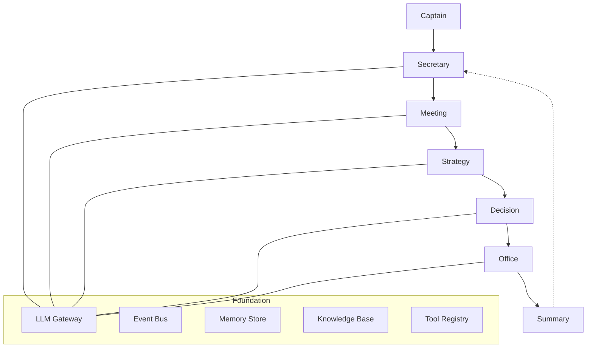

# 收尾 + 发布准备设计

> 日期：2026-05-05
> 状态：Draft
> 方案：严格分层递进（遗留修复 → PyPI 发布准备 → 端到端验证 → 文档审查）

---

## L1 遗留缺口修复

### 1.1 修复 `init` 命令提示

**问题**：[main.py:71](file:///c:/Users/dotty/Documents/trae_projects/Cabinet/src/cabinet/cli/main.py#L71) 中 `init` 命令的 Next steps 仍显示 `cabinet config set-key openai sk-xxx`，但该命令已弃用。

**方案**：将提示改为 `cabinet set-api-key sk-xxx --provider openai`，与弃用警告保持一致。

### 1.2 统一 `__version__` 定义

**问题**：版本号存在三处定义：
- `cabinet/__init__.py:1` — 硬编码 `__version__ = "0.1.0"`
- `cabinet/runtime.py:48-51` — 动态获取 `_pkg_version("cabinet")`，fallback `"0.1.0"`
- `cabinet/api/app.py:37` — 硬编码 `version="0.1.0"`

**方案**：
1. `cabinet/__init__.py` 改为动态获取版本号（单一真实来源）：
   ```python
   try:
       from importlib.metadata import version as _pkg_version
       __version__ = _pkg_version("cabinet")
   except Exception:
       __version__ = "0.1.0"
   ```
2. `runtime.py` 删除本地 `__version__` 定义，改为 `from cabinet import __version__`
3. `app.py` 改为 `from cabinet import __version__`，使用 `version=__version__`

### 1.3 创建 `api_examples.py` 跨平台 Python API 示例

**问题**：仅有 `api_examples.sh`（bash）和 `api_examples.ps1`（PowerShell），缺少跨平台 Python 版本。

**方案**：创建 `examples/api_examples.py`，使用 `httpx`（已是 dev 依赖），覆盖所有 API 端点：
- Health Check（/health, /ready）
- Chat REST（POST /api/chat）
- Employees CRUD
- Skills 列表/加载/运行
- Knowledge 索引/查询
- Rooms 操作（meeting/decision/task/strategy/review）
- Config 查询
- Prometheus Metrics

支持 `--base-url` 和 `--token` 参数。

### 1.4 README 添加 Mermaid 架构图

**问题**：README 仅有 ASCII 文本架构图，缺少直观的 Mermaid 图。

**方案**：在 Architecture 章节替换 ASCII 图为 Mermaid 图，展示六房间模型的数据流：



同时保留 ASCII 图作为 fallback（部分平台不支持 Mermaid）。

### 1.5 修复 `_shared.py` 导入路径

**问题**：`e2e_workflow.py:15` 和 `tutorial.py:16` 使用 `from _shared import setup_runtime`，直接运行 `python examples/e2e_workflow.py` 时可能因 Python 模块搜索路径问题而失败。

**方案**：在 `e2e_workflow.py` 和 `tutorial.py` 开头添加 `sys.path` 修正：

```python
import sys
import os
sys.path.insert(0, os.path.dirname(os.path.abspath(__file__)))
```

### 1.6 修复 `config set-key` 表格中的弃用标记

**问题**：README.md 和 README_CN.md 的 Config Management 表格中，`config set-key` 未标注弃用。

**方案**：在表格中添加 `(deprecated)` 标记，指向 `set-api-key`。

---

## L2 PyPI 发布准备

### 2.1 完善 `pyproject.toml`

当前缺失：作者、许可证、分类器、项目链接、README 指定。

**方案**：添加以下字段：

```toml
[project]
name = "cabinet"
version = "0.1.0"
description = "An open-source AI collaboration framework for super-individuals and one-person companies"
readme = "README.md"
license = "MIT"
requires-python = ">=3.12"
authors = [
    { name = "Cabinet Contributors" },
]
classifiers = [
    "Development Status :: 3 - Alpha",
    "Intended Audience :: Developers",
    "License :: OSI Approved :: MIT License",
    "Programming Language :: Python :: 3",
    "Programming Language :: Python :: 3.12",
    "Programming Language :: Python :: 3.13",
    "Topic :: Software Development :: Libraries :: Application Frameworks",
    "Framework :: FastAPI",
    "Framework :: Pydantic",
    "Typing :: Typed",
]
keywords = ["ai", "agent", "collaboration", "llm", "framework"]

[project.urls]
Homepage = "https://github.com/user/cabinet"
Documentation = "https://github.com/user/cabinet#readme"
Repository = "https://github.com/user/cabinet"
Issues = "https://github.com/user/cabinet/issues"
```

### 2.2 创建 LICENSE 文件

**问题**：项目缺少 LICENSE 文件，README 中引用了 MIT 许可证但文件不存在。

**方案**：创建 MIT LICENSE 文件。

### 2.3 创建 CHANGELOG.md

**方案**：创建 Keep a Changelog 格式的 CHANGELOG.md，记录 v0.1.0 的所有功能：

```markdown
# Changelog

All notable changes to this project will be documented in this file.

The format is based on [Keep a Changelog](https://keepachangelog.com/),
and this project adheres to [Semantic Versioning](https://semver.org/).

## [0.1.0] - 2026-05-05

### Added
- Six-Room architecture (Meeting, Strategy, Decision, Office, Summary, Secretary)
- Event sourcing with SQLite persistence
- LLM Gateway with LiteLLM integration
- KeyVault encrypted API key storage
- Audit logging with OpenTelemetry trace correlation
- REST API with FastAPI (chat, employees, skills, knowledge, rooms, config, health)
- CLI with Typer (init, serve, chat, status, set-api-key, config, employee, skill, knowledge)
- WebSocket streaming chat
- ChromaDB vector memory and knowledge base
- MCP (Model Context Protocol) tool integration
- OpenTelemetry distributed tracing
- Prometheus metrics (11 custom metrics)
- Health check endpoints (/health, /ready)
- Rate limiting with SlowAPI
- Docker deployment with health checks and resource limits
- CI/CD pipeline (lint, type-check, test, security, docker-build)
- Interactive tutorial and E2E workflow demo
```

### 2.4 版本号管理策略

**方案**：
- 版本号唯一定义在 `cabinet/__init__.py` 中
- `pyproject.toml` 中的 `version` 是构建时的入口（hatchling 从 `__init__.py` 动态读取）
- 使用 `hatch-vcs` 或手动管理版本号
- 发布流程：修改 `__init__.py` → 修改 `pyproject.toml` → git tag → build → publish

### 2.5 发布脚本

**方案**：创建 `scripts/release.sh`（跨平台用 Python 脚本更佳，但 bash 是 PyPI 发布惯例）：

```bash
#!/bin/bash
set -e
VERSION="${1:?Usage: scripts/release.sh <version>}"
# 1. Update version in __init__.py and pyproject.toml
# 2. Run tests
# 3. Build
# 4. Check
# 5. Publish to PyPI (test first)
```

---

## L3 端到端真实验证

### 3.1 Stub 模式验证

**方案**：运行 `python examples/e2e_workflow.py --data-dir data` 验证完整流程（无需 API key）。

### 3.2 API 服务器验证

**方案**：
1. 启动 `cabinet serve --port 8000 --data-dir data`
2. 验证 `/health` 和 `/ready` 端点
3. 运行 `python examples/api_examples.py --base-url http://localhost:8000`

### 3.3 真实 LLM 验证（可选）

**方案**：如果用户有 API key，运行 `python examples/e2e_workflow.py --data-dir data --live`。

---

## L4 文档最终审查

### 4.1 README/README_CN 同步检查

**方案**：逐项对比两个 README，确保内容一致。

### 4.2 CONTRIBUTING.md

**方案**：创建贡献指南，包含：
- 开发环境设置
- 代码风格（ruff）
- 测试要求
- PR 流程
- Commit 消息格式

### 4.3 API 文档自动生成

**方案**：FastAPI 自带 OpenAPI/Swagger 文档（`/docs`），无需额外配置。在 README 中补充说明。

---

## 任务总览

| 层级 | 任务 | 涉及文件 |
|------|------|---------|
| L1 | 1.1 修复 init 命令提示 | `src/cabinet/cli/main.py` |
| L1 | 1.2 统一 __version__ | `src/cabinet/__init__.py`, `src/cabinet/runtime.py`, `src/cabinet/api/app.py` |
| L1 | 1.3 创建 api_examples.py | `examples/api_examples.py` (新) |
| L1 | 1.4 README Mermaid 架构图 | `README.md`, `README_CN.md` |
| L1 | 1.5 修复 _shared.py 导入 | `examples/e2e_workflow.py`, `examples/tutorial.py` |
| L1 | 1.6 config set-key 弃用标记 | `README.md`, `README_CN.md` |
| L2 | 2.1 完善 pyproject.toml | `pyproject.toml` |
| L2 | 2.2 创建 LICENSE | `LICENSE` (新) |
| L2 | 2.3 创建 CHANGELOG.md | `CHANGELOG.md` (新) |
| L2 | 2.4 版本号管理 | `src/cabinet/__init__.py`, `pyproject.toml` |
| L2 | 2.5 发布脚本 | `scripts/release.sh` (新) |
| L3 | 3.1 Stub 模式验证 | 运行验证 |
| L3 | 3.2 API 服务器验证 | 运行验证 |
| L3 | 3.3 真实 LLM 验证 | 运行验证（可选） |
| L4 | 4.1 README 同步检查 | `README.md`, `README_CN.md` |
| L4 | 4.2 CONTRIBUTING.md | `CONTRIBUTING.md` (新) |
| L4 | 4.3 API 文档说明 | `README.md`, `README_CN.md` |
